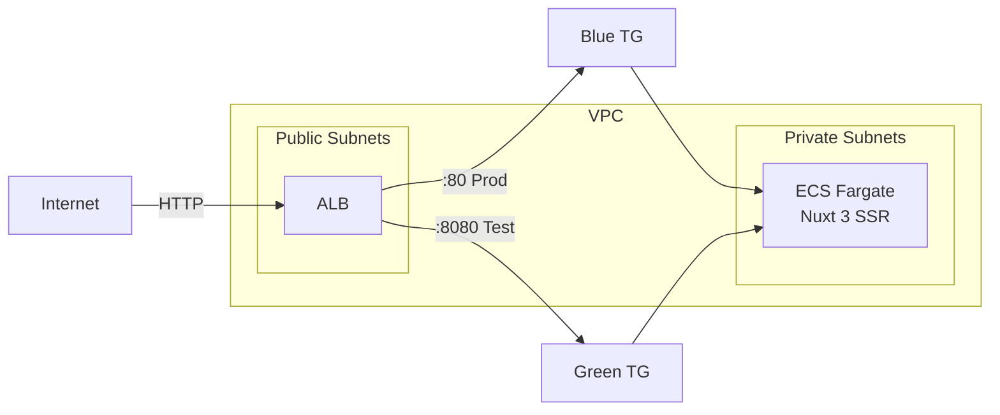
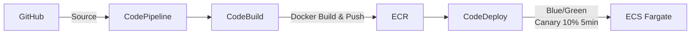
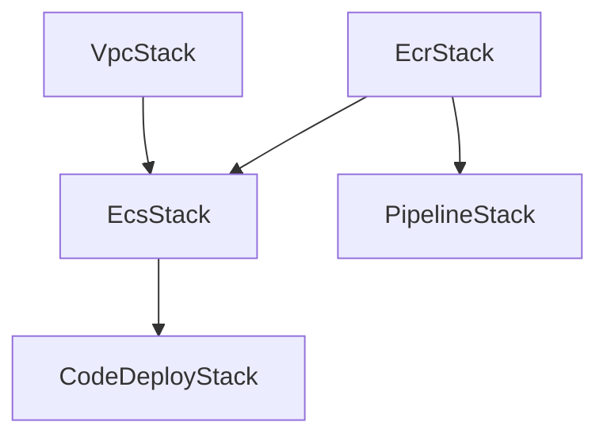

# Architecture

## System Overview

```mermaid
graph LR
    Internet -->|HTTP| ALB
    ALB -->|:80 Prod| Blue[Blue TG]
    ALB -->|:8080 Test| Green[Green TG]
    Blue --> ECS[ECS Fargate<br/>Nuxt 3 SSR]
    Green --> ECS

    subgraph VPC
        subgraph Public Subnets
            ALB
        end
        subgraph Private Subnets
            ECS
        end
    end
```

## CI/CD Pipeline

```mermaid
graph LR
    GitHub -->|Source| CodePipeline
    CodePipeline --> CodeBuild
    CodeBuild -->|Docker Build & Push| ECR
    ECR --> CodeDeploy
    CodeDeploy -->|Blue/Green<br/>Canary 10% 5min| ECS[ECS Fargate]
```

## Infrastructure Stacks

```mermaid
graph TD
    VpcStack --> EcsStack
    EcrStack --> EcsStack
    EcsStack --> CodeDeployStack
    EcrStack --> PipelineStack
```
